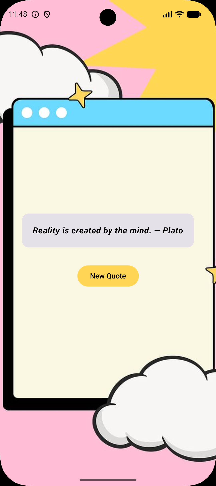

# ✨ Philosophy Quotes App

Android application built with Kotlin and Jetpack Compose.

Philosophical inspiration quotes with modern UI.

---

## 📱 About The Project

Quotes App created by **Patricia Gea** focused on learning modern Android development using:

- Kotlin
- Jetpack Compose
- State Management
- UI Design
- Android Resources

---

## ✨ Features

- Random quote generator
- Philosophical and motivational quotes
- Modern Jetpack Compose UI
- Background image support
- Responsive layout
- Soft aesthetic design

---

## 🛠 Technologies Used

- Kotlin
- Jetpack Compose
- Android Studio
- Material 3

---

## 📸 Screenshots

---

## 🚀 Learning Goals

This project was created to practice:

- Compose layouts
- State handling
- UI customization
- Android resources
- Mobile UI design
- Clean code structure

---

## 👩‍💻 Author

### Patricia Gea

Mobile and  Frontend Developer, with 17 years of previous experience as a business owner, building and managing businesses across Brazil and Sweden.

---

## 🌐 Connect With Me

### LinkedIn
https://www.linkedin.com/in/patriciageadev

### Portfolio
https://patriciageadev.vercel.app

### GitHub
https://www.github.com/PatriciaGea

---

